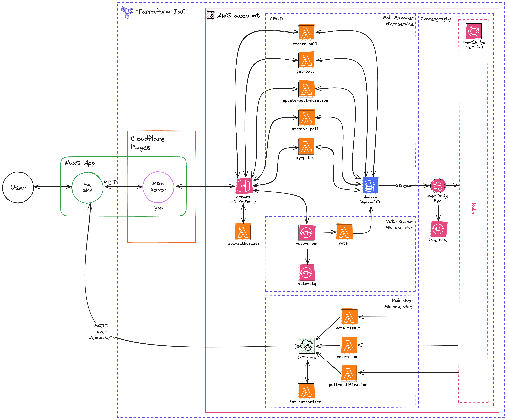

# PseudoPoll

## Technologies

- Infrastructure
  - Terraform IaC
  - Cloudflare
    - DNS
    - Pages
  - AWS
    - API Gateway (REST)
    - Lambda
    - DynamoDB
    - EventBridge
      - Event Bus
      - Pipe
    - SQS
    - IoT Core
    - CloudWatch
    - ACM
    - IAM
    - S3
- Backend
  - Lambdas written in Go
  - Microservices
    - Poll manager (REST API for CRUD operations)
    - Vote queue (queue-based load leveling)
    - Publisher (MQTT over WebSockets)
  - JWT authorization
  - DynamoDB for persistence (single-table design)
    - Streams for change events
  - Choreographed by EventBridge
- Frontend
  - TypeScript
  - Nuxt 3
    - Vue 3 SPA
    - Nitro Server (BFF)
    - Edge-side rendering (ESR) via Cloudflare
  - Authentication via Google OAuth
  - Nuxt UI
    - Tailwind CSS

## Architecture

